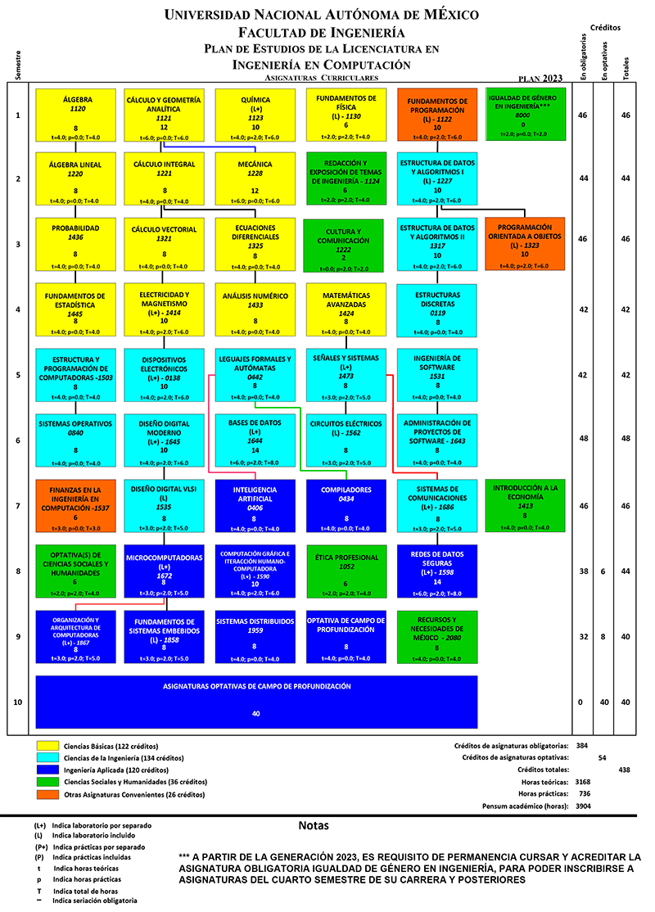

# Syllabus Oficial - Laboratorio de Bases de Datos (Clave 1644)

**Semestre:** 2026-2  
**Contacto:** M.I.A Martha López Pelcastre (martha.lopez@ingenieria.unam.edu)

---
## Descripción
Este documento contiene los elementos necesarios para el que alumno conozca la información que requiere en el desarrollo de la materia de Laboratorio de Bases de Datos.

---

## Contenido
1. [Objetivo](##1.-Objetivo) 
2. [Mapa curricular](##2.-Mapa-curricular) 
3. [Prácticas a realizar](##3.-Prácticas-a-realizar)
4. [Software a utilizar](##4.-Software-a-utilizar)
5. [Contenido de las prácticas](##5.-Contenido-de-las-prácticas)
6. [Lineamientos](##6.-Lineamientos)
7. [Lineamientos a considerar](##7.-Lineamientos-a-considerar)
8. [Sistema de evaluación](##8.-Sistema-de-evaluación)
9. [Calendario de Practicas Grupo 02.- Día martes](9.Calendario-de-Practicas-Grupo-02.--Día-martes)
10. [Calendario de Practicas Grupo 07.- Día viernes](##10.--Calendario-de-Practicas-Grupo-07.--Día-viernes) 
11. [Calendario de Practicas Grupo 08.- Día sábado](##11.--Calendario-de-Practicas-Grupo-08.--Día-sábado)
12. [Bibliografía](##12.-Bibliografía) 
    1. [Referencias electrónicas](###Referencias-electrónicas)
13. [Contacto](##13.-Contacto)

---

## 1. Objetivo
Esta asignatura tiene como objetivo principal practicar el uso de la tecnología de Bases
de Datos en la implementación de sistemas de información, así como familiarizarse con
el diseño, implementación y explotación de las mismas.

---

## 2. Mapa curricular
Denominación de la asignatura: laboratorio de Base de Datos 6644, sexto semestre plan 2023

  

---

## 3. Prácticas a realizar

| No. PRACTICA            | NOMBRE |
|:------------------:|:---------:|
| 1|Presentación del curso Acceso al servidor, instalación del sistema operativo| 
| 2|Entorno de trabajo| 
| 3|Introducción al lenguaje de control de acceso a Datos (DCL)| 
| 4|Diseño de modelos básicos E/R con notación Chen utilizando una herramieta CASE| 
| 5|Diseño básico de modelos relacionales| 
| 6|Diseño de modelos avanzados E/R con notación Chen| 
| 7|Diseño avanzado de modelos relacionales|
| 8|Normalización| 
| 9|Leguaje de definición de datos (DDL)| 
| 10|Lenguaje de manipulación de datos (DML) y transacciones|
| 11|Álgebra relacional y uso de join básico| 
| 12|Consultas básicas en SQL y funciones de agregación| 
| 13|Utilización de distintos tipos de JOIN, subconsultas y vistas|
| 14|Programación básica con SQL.|

---
## 4. Software a utilizar
- [x] Manejador de base de datos: SQL Server 2022
- [x] Herramienta CASE: ER/Studio
- [x] Diagramador: DIA

---

## 5. Contenido de las prácticas
**Las prácticas deben contener:**
1. Objetivo
2. Introducción (de la práctica no la del manual de prácticas)
3. Desarrollo.
    1. Descripción de las actividades de las prácticas (enunciados de las actividades y comentarios personales)
    2. Análisis de resultados
4. **Conclusiones individuales**
5. Bibliografía (no se acepta únicamente clases de la profesora o manual de
prácticas)

---

## 6. Lineamientos

- Las prácticas deben entregarse de manera electrónica los días:
|Grupo|REALIZA|ENTREGA|
|:------------------:|:---------:|:--------------------:|
|02|MARTES|VIERNES|
|07|VIERNES|MARTES|
|08|JUEVES|MIERCOLES|

- Los entregables son:

  - Informe de la práctica en formato PDF que contenga el desglose de la misma, incluyendo imágenes de las pantallas en donde se visualice la ejecución de los comandos de cada actividad, o modelos realizados en clase de manera individual y conjunta (por equipo).
  
  - Los scripts o archivos generados de cada una de las actividades.

- De no enviarse alguno de ellos, la práctica se considera como no entregada y se califica con 0

- Las prácticas se entregan mediante CLASSROOM.
  
  - Si hubiera algún problema con la herramienta, debe enviarse el día **correspondiente** por correo, el asunto debe tener el siguiente texto: número de equipo - el número de la práctica - nombre de la práctica.
    
    - **Ejemplo:** 4Equipo – 1Práctica - Entorno de trabajo

- El cuerpo del correo debe contener los nombres completos de cada integrante. La práctica se contará como no entregada en caso de no tener su nombre completo en el cuerpo del mensaje y se califica con 0.

- Las prácticas entregadas después del día estipulado tendrán calificación de 6 automáticamente.

- Si se entrega una práctica, pero no asistió a la clase se califica sobre 8.

- Los archivos de las prácticas deben tener como nombre; número de equipo y el número de práctica.
    
    - **Ejemplo:** 8Equipo-3Práctica.pdf
    
    - **En el caso de los ejercicios:** 8equipo-3práctica-2ejercicio.dia

---

## 7. Lineamientos a considerar
- Leer la introducción de la práctica correspondiente del Manual de Prácticas previa realización de la misma

- Humildad, respeto y honestidad

- Requerido 80% de asistencia a clase, la asistencia se toma del ejercicio entregado en cada clase (únicamente en el horario de clase).

- Si no es posible asistir a una práctica deberá notificarse por correo con el documento que acredite la justificación de la inasistencia.

- Obligatorio entregar todas las prácticas para exentar el laboratorio

- Participación
  - Crítica de calidad, que aporte
  - Trabajo en equipo

---

## 8. Sistema de evaluación
- [x] 50 % Prácticas (todas entregadas)
- [x] 20 % Previos
- [x] 30 % Examen de laboratorio

**Nota:** para acreditar se deben entregar todas las prácticas y tener calificación aprobatoria en el examen final.

- **NP** 

De acuerdo al Reglamento General de Exámenes en su artículo tercero la calificación de NP se obtiene, “En el caso que el alumno no se presente al examen de la materia, se anotará NP, que significa: no presentado”, en específico para nuestro curso, un alumno puede obtener NP, si solamente entregó la práctica 1.

LABORATORIO DE BASE DE DATOS

## 9.  Calendario de Practicas Grupo 02.- Día martes

|No.|NOMBRE DE LA PRÁCTICA|REALIZA|ENTREGA|
|:-----:|:-----:|:-----:|:-----:|
|1|Presentación del curso y acceso al servidor, instalación del sistema operativo|3/2/2026|6/2/2026|
|2|Entorno de trabajo|3/2/2026|6/2/2026|
|3|Introducción al lenguaje de control de acceso a Datos (DCL)|3/2/2026|6/2/2026|
|4|Diseño de modelos básicos E/R con notación Chen utilizando una herramieta CASE|3/2/2026|6/2/2026|
|5|Diseño básico de modelos relacionales|3/2/2026|6/2/2026|
|6|Diseño de modelos avanzados E/R con notación Chen|3/2/2026|6/2/2026|
|7|Diseño avanzado de modelos relacionales|3/2/2026|6/2/2026|
|8|Normalización|3/2/2026|6/2/2026|
||**VACIONES SEMANA SANTA**|31/3/2026|4/4/2026|
|9 y 10|Leguaje de definición de datos (DDL) /Lenguaje de manipulación de datos (DML) y transacciones |3/2/2026|6/2/2026|
|11|Álgebra relacional y uso de join básico|3/2/2026|6/2/2026|
|12|Consultas básicas en SQL y funciones de agregación|3/2/2026|6/2/2026|
|13|Utilización de distintos tipos de JOIN, subconsultas y vistas|3/2/2026|6/2/2026|
|14|Programación con SQL|3/2/2026|6/2/2026|
||Realización del examén|12/5/2026|12/5/2026|
||Entrega de calificaciones|19/5/2026|19/5/2026|

---

## 10.  Calendario de Practicas Grupo 07.- Día viernes

|No.|NOMBRE DE LA PRÁCTICA|REALIZA|ENTREGA|
|:-----:|:-----:|:-----:|:-----:|
|1|Presentación del curso y acceso al servidor, instalación del sistema operativo|3/2/2026|6/2/2026|
|2|Entorno de trabajo|3/2/2026|6/2/2026|
|3|Introducción al lenguaje de control de acceso a Datos (DCL)|3/2/2026|6/2/2026|
|4|Diseño de modelos básicos E/R con notación Chen utilizando una herramieta CASE|3/2/2026|6/2/2026|
|5|Diseño básico de modelos relacionales|3/2/2026|6/2/2026|
|6|Diseño de modelos avanzados E/R con notación Chen|3/2/2026|6/2/2026|
|7|Diseño avanzado de modelos relacionales|3/2/2026|6/2/2026|
|8|Normalización|3/2/2026|6/2/2026|
||**VACIONES SEMANA SANTA**|31/3/2026|4/4/2026|
|9 y 10|Leguaje de definición de datos (DDL) /Lenguaje de manipulación de datos (DML) y transacciones |3/2/2026|6/2/2026|
|11|Álgebra relacional y uso de join básico|3/2/2026|6/2/2026|
|12|Consultas básicas en SQL y funciones de agregación|3/2/2026|6/2/2026|
|13|Utilización de distintos tipos de JOIN, subconsultas y vistas|3/2/2026|6/2/2026|
|14|Programación con SQL|3/2/2026|6/2/2026|
||Realización del examén|12/5/2026|12/5/2026|
||Entrega de calificaciones|19/5/2026|19/5/2026|

---

## 11.  Calendario de Practicas Grupo 08.- Día sábado

|No.|NOMBRE DE LA PRÁCTICA|REALIZA|ENTREGA|
|:-----:|:-----:|:-----:|:-----:|
|1|Presentación del curso y acceso al servidor, instalación del sistema operativo|3/2/2026|6/2/2026|
|2|Entorno de trabajo|3/2/2026|6/2/2026|
|3|Introducción al lenguaje de control de acceso a Datos (DCL)|3/2/2026|6/2/2026|
|4|Diseño de modelos básicos E/R con notación Chen utilizando una herramieta CASE|3/2/2026|6/2/2026|
|5|Diseño básico de modelos relacionales|3/2/2026|6/2/2026|
|6|Diseño de modelos avanzados E/R con notación Chen|3/2/2026|6/2/2026|
|7|Diseño avanzado de modelos relacionales|3/2/2026|6/2/2026|
|8|Normalización|3/2/2026|6/2/2026|
||**VACIONES SEMANA SANTA**|31/3/2026|4/4/2026|
|9 y 10|Leguaje de definición de datos (DDL) /Lenguaje de manipulación de datos (DML) y transacciones |3/2/2026|6/2/2026|
|11|Álgebra relacional y uso de join básico|3/2/2026|6/2/2026|
|12|Consultas básicas en SQL y funciones de agregación|3/2/2026|6/2/2026|
|13|Utilización de distintos tipos de JOIN, subconsultas y vistas|3/2/2026|6/2/2026|
|14|Programación con SQL|3/2/2026|6/2/2026|
||Realización del examén|12/5/2026|12/5/2026|
||Entrega de calificaciones|19/5/2026|19/5/2026|

---

## 12. Bibliografía
> ARELLANO, Lucila, HERNÁNDEZ, Luciralia, Todas Manual de prácticas de la asignatura de Bases de Datos, México UNAM, Facultad de Ingeniería

> DE MIGUEL, Adoración, PALOMA CASTRO, Todas Elena, Diseño de bases de datos (Problemas Resueltos), México Alfaomega, 2001

> ROB, Peter, CORONEL, Carlos Todas, Database systems (Design, Implementation and Management), 6th edition 
 
> Course Technology, 2004, PEREZ, Cesar 3,5,6,7,8,9,10,11,13,14

> Microsotf sql server 2008 r2. Curso práctico
RA-MA, 2011

> Manual de Practicas Todas

---

### Referencias electrónicas

> Administración de base de datos con SQL Server 3,5,6,7,8,9,10,11,13, 2008, http://www.v-14espino.com/~chema/daw1/tutoriales/SQLServer.pdf

> Libros en pantalla de SQL Server 2008 R2, 3,5,6,7,8,9,10,11,13,
https://www.microsoft.com/es-14mx/download/confirmation.aspx?id=9071

---

## 13. Contacto
martha.lopez@ingenieria.unam.edu

---
